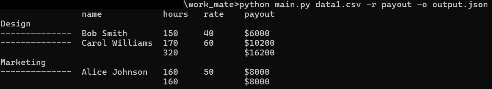

# Employee Report Generator

Этот скрипт обрабатывает CSV-файлы с данными сотрудников и генерирует отчеты в текстовом или JSON-формате.

## Требования
- Python 3.10 или новее (из-за использования `match`)

## Использование

### Запуск скрипта
```
python main.py [ФАЙЛЫ.csv] [--report ТИП_ОТЧЕТА] [--output ФАЙЛ.json]
```

### Аргументы
- `ФАЙЛЫ.csv`: Один или несколько CSV-файлов для обработки
- `--report` (`-r`): Тип отчета (доступно: `payout`, `mean`). По умолчанию: `payout`
- `--output` (`-o`): Сохранить сырые данные в JSON-файл

### Примеры
1. Генерация отчета о выплатах:
   ```
   python main.py data1.csv --report payout
   ```

2. Расчет средней зарплаты с сохранением данных:
   ```
   python script.py *.csv -r mean -o data.json
   ```

## Формат входных данных
CSV-файлы должны содержать следующие колонки:
```
id, name, email, department, hours_worked, [salary / hourly_rate / rate]
```
Пример:
```csv
id,name,email,department,hours_worked,salary
1,John,john@company.com,IT,160,50
```

## Типы отчетов

### 1. Отчет о выплатах (`payout`)
Формат:


### 2. Средняя зарплата (`mean`)
Формат:


## Выходные данные
При использовании `--output` сохраняет обработанные данные в JSON-формате:
```json
[
  {
    "id": 1,
    "name": "John",
    "email": "john@example.com",
    "department": "IT",
    "hours_worked": 160,
    "salary": 50
  }
]
```

## Ограничения
- Все входные файлы должны иметь расширение `.csv`
- Выходной файл для JSON должен иметь расширение `.json`
- При обнаружении ошибок ввода скрипт завершается с сообщением об ошибке
